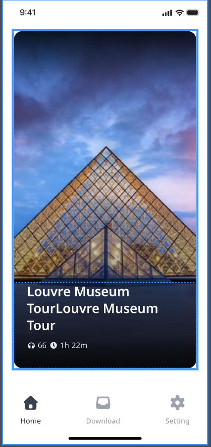

서비스 아키텍처
- 프론트 구성 : nextjs 로 개발 및 vercel로 웹 서버 구동
- 백엔드 : supabase를 활용한 노코드 백엔드 구성

서비스 설명
- 오디오 셀프 투어 서비스
  > 오디오/비디오 영상을 시청하면서, 미술관/박물관 셀프 투어
  > 작품에 대한 설명과, 미술관/박물관의 이동 동선 안내
  > 기타 다양한 배경 설명 제공

백엔드 기능
- 투어 목록 조회
  > 투어 제목, 설명, 이미지 등 제공
- 투어 상세 조회
  > 투어 상세 정보 제공
- 투어 트랙 정보 제공
  > 투어는 하나 이상의 보통 수십개의 트랙으로 구성 되어 있음
  > 작품 마다 별도의 트랙으로 구성 되며, 내부 이동 동선이나, 배경 설명도 별도의 트랙으로 구성
  > 각 트랙은 오디오/비디오 파일을 포함
  > 각 트랙은 썸네일 이미지를 포함
  > 각 트랙은 제목, 설명, 재생 시간 등을 포함
- 샘플 데이터는 아래 api들을 통해서 확인 가능
  > 투어 목록 조회 : https://api.tourlive.co.kr/v4/tours?page_size=10
  > 투어 정보 조회 : https://api.tourlive.co.kr/v4/tours/1267
  > 투어 트랙 정보 조회 : https://api.tourlive.co.kr/v4/tours/1267/tour_tracks

웹 서비스 소개
- 메인 페이지
  
  > 첨부 이미지는 투어 목록이 하나인 경우, N개이면 가로로 스크롤 되어야 함
- 투어 상세 화면
  > 샘플 페이지: https://www.tourlive.co.kr/tour/1267
  > 투어에 대한 설명과 트랙 목록을 제공
  > UI는 샘플 보다 더 심플하고 모던 하게 구성 해줘
  